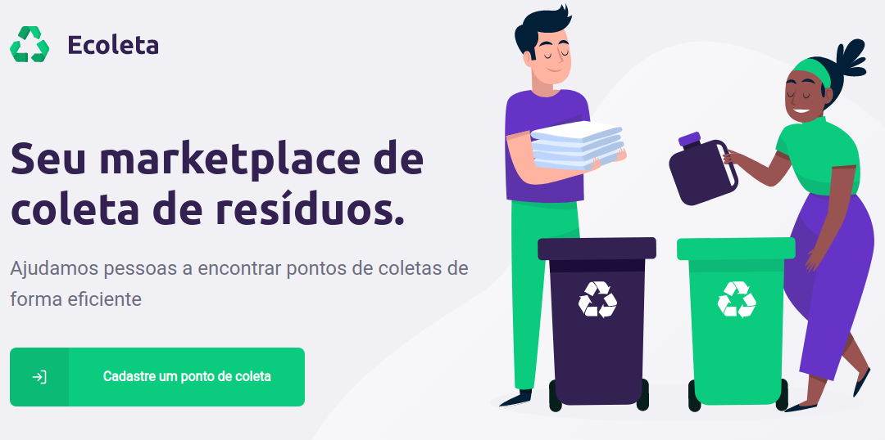
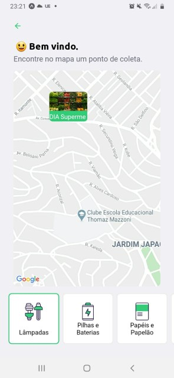

# Next Level Week 1 - Ecoleta

## What is this project?
I have made this project by watching [Next Level Week](https://nextlevelweek.com/) classes. It was 5 days of building an app called "Ecoleta", where markets could apply to collect recyclabe trash.

Markets can register a point in a map where they are, their contact information and selected what kind of items they collect (plastic, battery, etc).

## Tecnologies

This app is build with React, React Native and Node. All projects using Typescript so I could have help from intellisense.

* Node: It's used with [Express](https://github.com/expressjs/express) for backend server and also some other cools libraries like [Multer](https://github.com/expressjs/multer) (handling "multipart/form-data" requests and used for image uploading) and [Knex](http://knexjs.org/) for SQL query building.
    The database used is maintain data is [SQLite](https://www.sqlite.org/).

    In order to run the server, for database creating and populating with some data that is needed for the application, you can run:
    `npm run knex:migrate` (creates database) and `npm run knex:seed` (populates database) 
* React: Used for frontend Single Page Application. Here we used [axios](https://github.com/axios/axios) to execute HTTP requests to backend, [Leaflet](https://leafletjs.com/) as a open source library to a interactive map and also other React Libraries like icons, dropzone (drag 'n' drop), router, etc.
* React Native: Used along with [Expo](https://expo.io/) to create a hybrid mobile app. Also some other cool libraries like [react-native-emoji](https://github.com/EricPKerr/react-native-emoji), [react-native-picker-select](https://github.com/lawnstarter/react-native-picker-select), [react-native-maps](https://github.com/react-native-community/react-native-maps) and more.

It was a really cool project to experiment the React/Native/Node stack. I was looking for try React and had this oportunity with Next Level Week's course. I know that this project didn't used the best practises, but I will study more about React in the future.